# Lesson 0 - Introduction

#### [YouTube video](https://youtu.be/v_VubQ_NZMc) - **Watch this first!**

## 0.0 Introduction

In this lesson we walk through the steps for setting up the ComputerCraft mod on
your computer and setting up a Github account. We are also introduced to our
first commands.

## 0.1 Setting Up ComputerCraft

In this section we will go through the steps to set up the ComputerCraft mod on
your computer.

### 0.1.1 Downloading and installing MultiMC

1. Navigate to [multimc.org](https://multimc.org)
2. Go to [the download page](https://multimc.org/#Download)
3. Download the binary corresponding to your OS
4. Navigate through the installer
5. Open MultiMC and sign in with your Mojang/Microsoft account

### 0.1.2 Creating a MultiMC instance

> As an alternative to the remainder of section 0.1, you can use the import from
> zip option when creating a new MultiMC instance to import the
> [MultiMC Instance file](https://github.com/M3L6H/programming-bootcamp/raw/main/resources/MultiMC%20Instance.zip)
> in the resources folder of this repo

1. Click the create instance button

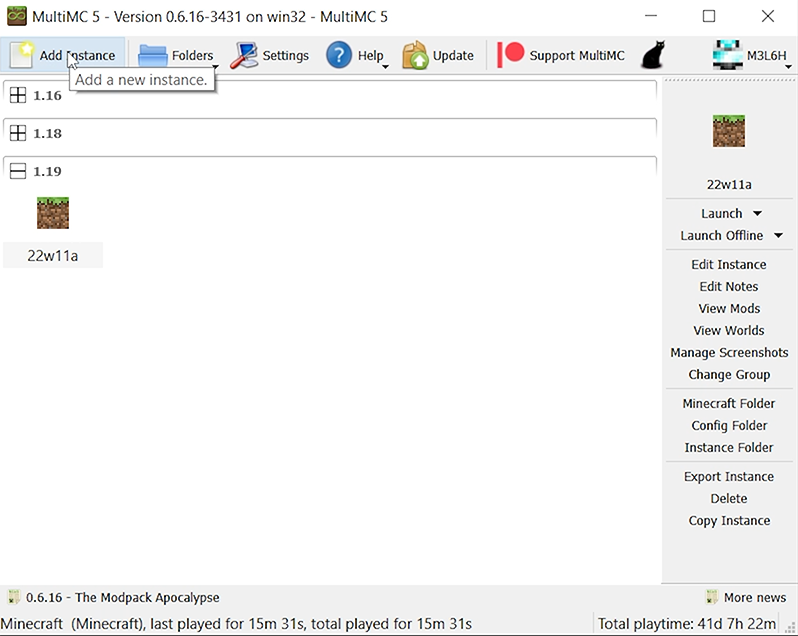

2. Fill in the Name field & select version `1.19.1`

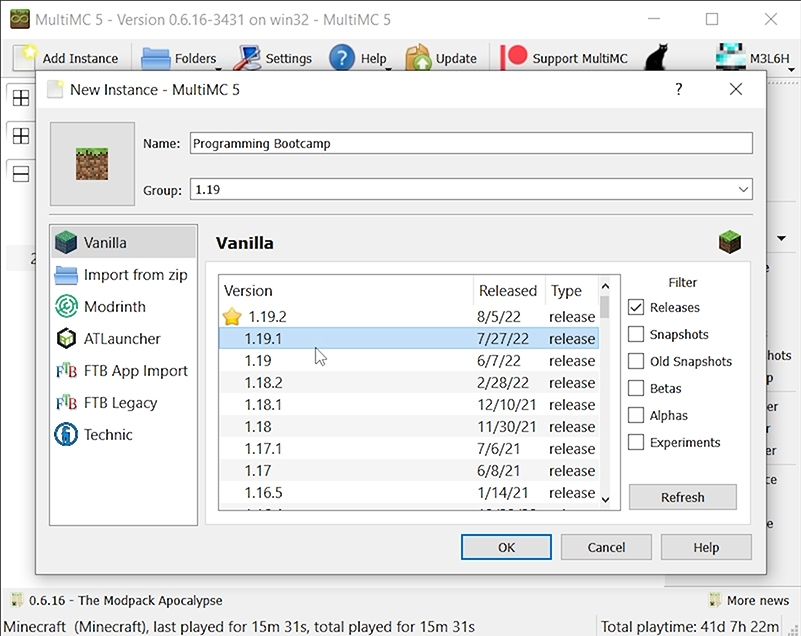

### 0.1.3 Downloading and installing the ComputerCraft mod

1. Navigate to [the CC: Tweaked files list](https://www.curseforge.com/minecraft/mc-mods/cc-tweaked/files/all)
2. Download the latest version of the mod for Minecraft version `1.19.1`
3. Select the instance created previously in MultiMC

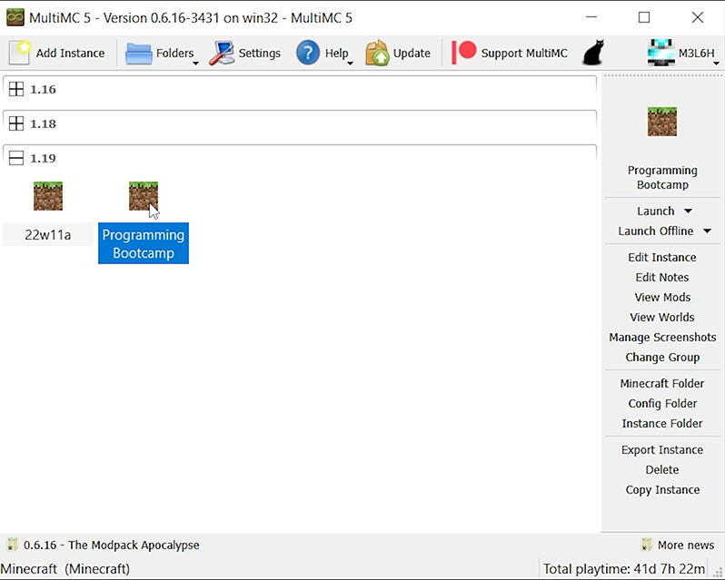

4. Open the instance by clicking on the edit instance button
5. Click on the install Forge button

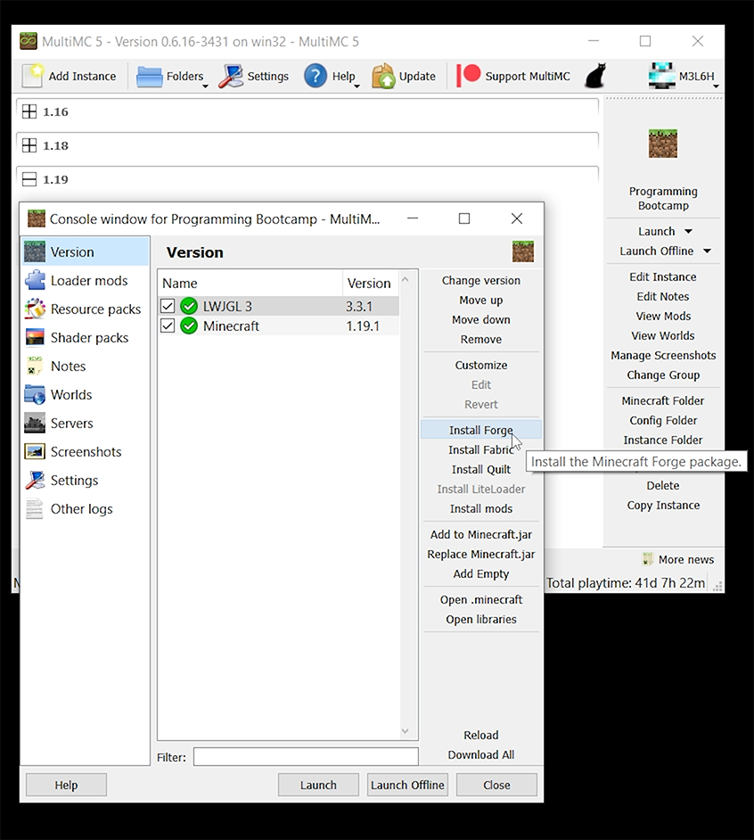

6. Use the recommended Forge version

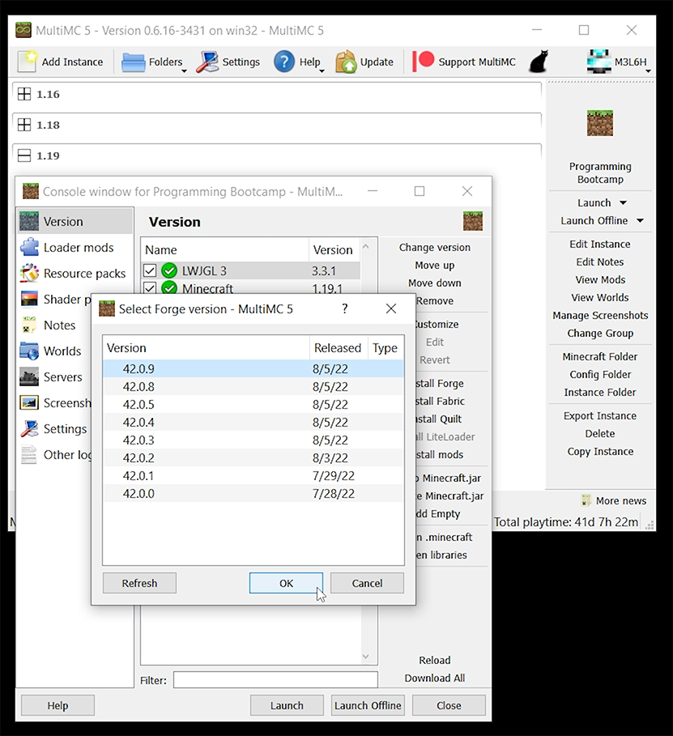

7. Go to the loader mods section

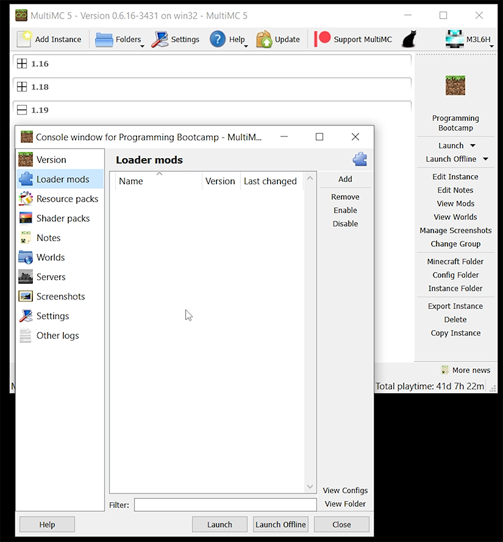

8. Click and drag the downloaded mod jar into the loader mods window

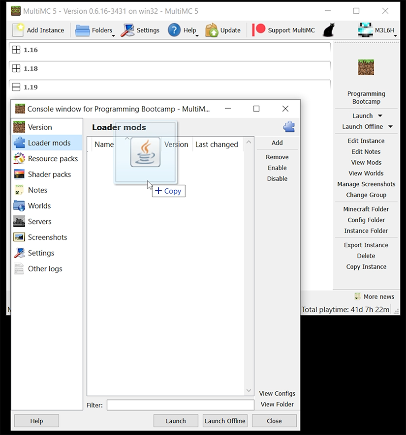

9. Verify ComputerCraft was installed successfully by:
  - Loading up Minecraft
  - Creating a creative test world
  - Finding the ComputerCraft tab in the creative menu

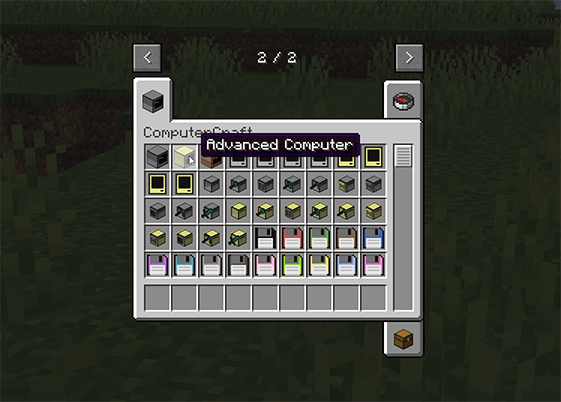

## 0.2 Setting Up Github & Git Bash

In this section, we will go through the steps to set up a Github repository for
your code. Then we will go over how to set up git bash on your local machine.

### 0.2.1 Github Repository

1. Navigate to [github.com](https://github.com)
2. Click the sign up button and follow the steps to create a Github account
3. When your account is created, click on the `+` button to create a new repository

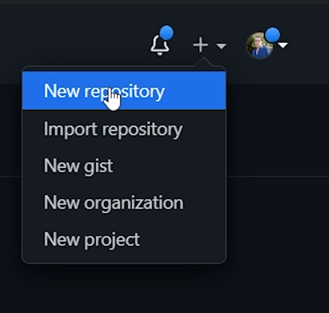

4. Fill out the repository details

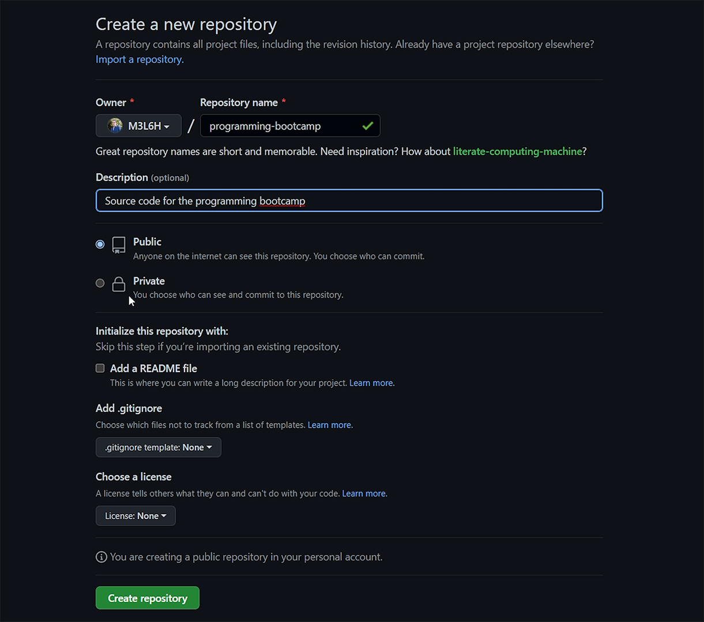

5. Click the `Create repository` button

### 0.2.2 Set Up Git Bash

1. Go to [the git bash download page](https://git-scm.com/downloads)
2. Download the version of git bash corresponding to your OS
3. Walk through the installer
4. Walk through [the Github instructions for setting up ssh](https://docs.github.com/en/authentication/connecting-to-github-with-ssh/checking-for-existing-ssh-keys)
5. For convenience, the instructions are included in this document as well
  - Inside of git bash, run
```sh
ls -al ~/.ssh
```
  - You should see some form of error output
  - Run the following command to generate your keys
```sh
ssh-keygen -t ed25519 -C 'your_email@example.com'
```
  - Use the default file location (just hit enter when prompted)
  - Set a passphrase if you want (you can skip by pressing enter when prompted)
  - Run the following command to start the ssh agent
```sh
eval "$(ssh-agent -s)"
```
  - Once it has started, run the following command to add your private key to it
```sh
ssh-add ~/.ssh/id_ed25519
```

### 0.2.3 Add Your SSH Key to Github

1. Go to [your SSH & GPG keys page](https://github.com/settings/keys)
2. Click the New SSH Key button

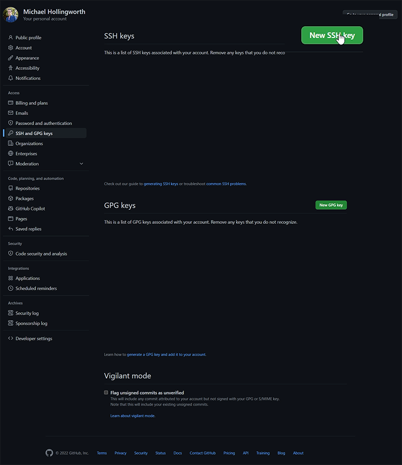

3. In git bash, run the following command

```sh
cat ~/.ssh/id_ed25519.pub
```

4. Copy the output of the command and paste it into the input for the new SSH key

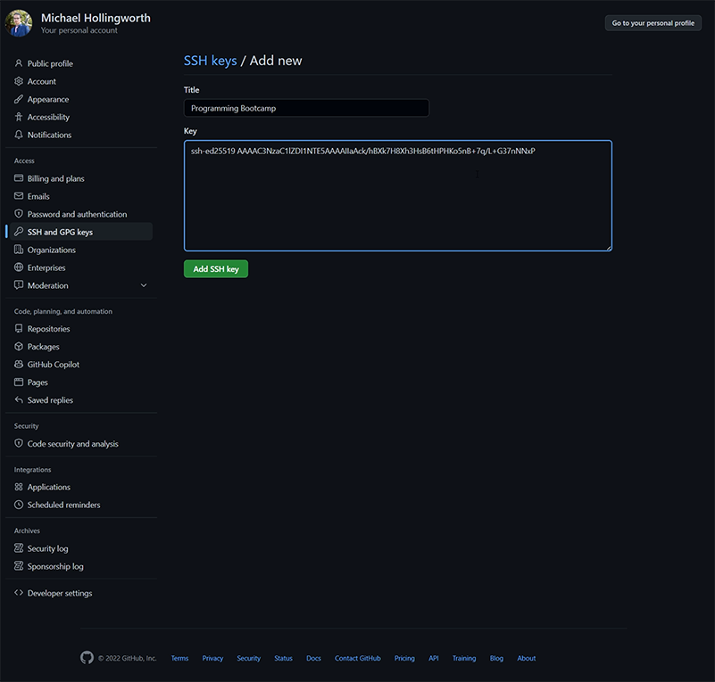

5. Make sure to give the key a title and click the `Add SSH Key` button

### 0.2.4 Initial Commit

1. Create a folder on your computer that will store all the code you write for this course
2. Right click inside the folder to open git bash there
3. In git bash, run the following command to create a README

```sh
echo '# Programming Bootcamp' > README.md
```

4. Run the following command to create a `main` branch

```sh
git checkout -b main
```

5. Run the following command to stage your changes

```sh
git add .
```

6. Run the following command to write a commit message

```sh
git commit -m 'Initial commit'
```

7. Navigate to the repository you created and copy the url (should begin with `git@github.com`)

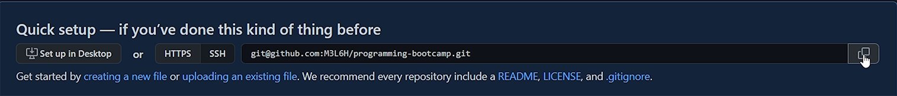

8. In git bash, run the following command to connect your local repo to Github (**Ensure when you paste the url that you don't have the angle brackets**)

```sh
git remote add origin <the url you copied in step 7>
```

9. Run the following command to ensure you're on a main branch

```sh
git branch -M main
```

10. Run the following command to push your code up to Github

```sh
git push -u origin main
```

11. Refresh the page of your repository. You should see the README we created

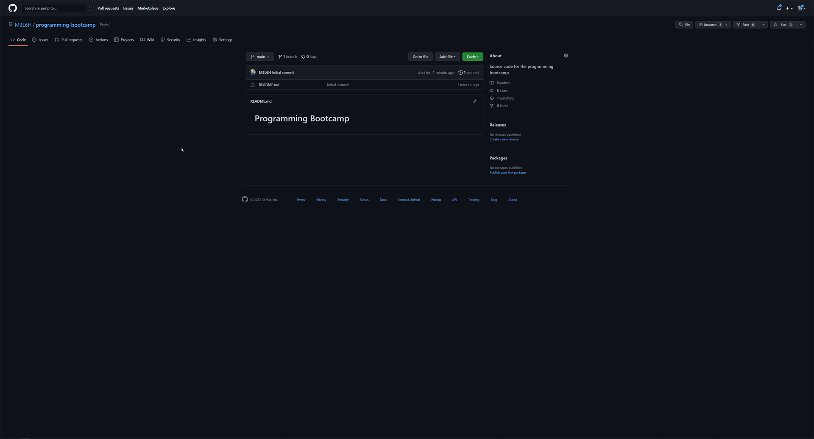

## Success

You've done it! Time to move on to [Lesson 1](https://github.com/M3L6H/programming-bootcamp/blob/lesson-1/writeups/Lesson%201.md).
