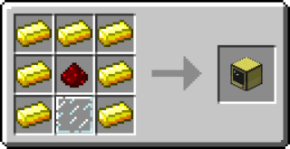
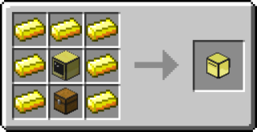

# Lesson 1 - Turtles

#### [YouTube video](https://youtu.be/qSYLWRGoB8U) - **Watch this first!**

## 1.1 Making the Turtle

Before we can make our first turtles, we need to first gather the resources for
them. To make the items that we make in this video, you will need:

- 3 `diamonds`
- 29 `gold`
- 6 `glass`
- 1 `redstone dust`
- 1 `chest`

Once you have gathered those materials, you can make an advanced turtle by
using the following recipes:





Then you can combine that turtle with a diamond pickaxe in any crafting grid to
make an advanced mining turtle.

Similarly, you can make an advanced pocket computer with the following recipe:


## 1.2 Basic Commands

In this section we are introduced to some basic commands.

### help

`help` is used to get information about a particular command.

Example:

```sh
> help list
ls will list all the directories and
files in the current location. Use
"type" to find out if an item is a file
or a directory.

>
```

### programs

`programs` lists the available programs in the computer.

### list

`list` or `ls` is used to list out the contents of the directory you are
currently in.

You can also pass it an argument to list the contents of a directory other than
the one you are currently in.

Example:

```sh
> ls
resources src writeups
README.md
> ls src/scripts
cuttree.lua helloworld.lua
> cd writeups
writeups > ls
images
'Lesson 0.md' 'Lesson 1.md'
>
```

### type

`type` is used to determine whether something is a file or directory. The
equivalent in git bash is `file`. Both of these commands take one argument, the
item to examine.

Example:

```sh
> ls
rom
> type rom
directory
>
```

### cd

`cd` (which stands for change directory) is used to change the current directory
you are in. If you want to change to the directory `/rom/help`, you would run
`cd /rom/help`. If you want to go the parent directory of the one you are
currently in, run `cd ..`. You can go up multiple parents by chaining on extra
`..` like so: `cd ../..`. Lastly, to go back to the root directory from whatever
path you are in, use `cd /`.

In unix systems (Mac/Linux) or when using git bash on windows, there is the
concept of a home directory. You can navigate to this by using `cd ~`.

Example:

```sh
> ls
resources src writeups
> cd resources
resources > cd ../
> cd writeups/images
writeups/images > cd /
> cd src/scripts
src/scripts > cd ../
src > cd ../writeups
writeups >
```

### clear

`clear` will clear the screen. It works in both computercraft and git bash.

### edit

`edit` is a command unique to the ComputerCraft mod. An equivalent in git bash
is `vim` (although the `vim` editor can be quite confusing). It takes one
argument, the name of the file to edit (i.e. `edit helloworld`). If the file
does not exist, it creates it. Otherwise it opens the file for editing.

The computercraft mod is unique in that if you do not supply an extension when
using the `edit` command (i.e. `edit helloworld` instead of
`edit helloworld.lua`), it assumes that you want to make a lua script and
automatically appends the `.lua` extension. If you tried this with `vim` in git
bash, it would just create a file literally named `helloworld`.

Once the file editing window is open, you can type and navigate within it as
you would a normal text editor. To save, run, or exit the file, hit `ctrl` and
use the arrow keys to select the desired option.

In the `vim` editor on the other hand, while you can navigate around with the
arrow keys, you cannot immediately type. Instead, you must first press the `i`
key to enter into insert mode. This will let you type text as normal. When you
are done editing, press `esc` to leave edit mode. You can then save the file by
typing `:w` and pressing enter. You can close the editor by typing `:q` and
pressing enter. You cannot run a file from inside `vim`.

## 1.3 Hello World

A program is a series of instructions to the computer. An instruction can be
thought of simply as a command that is in a program. The syntax for them is
slightly different, but an instruction also has a name and arguments.

Example:

```lua
print("Hello World")
-- print is the name
-- "Hello World" is the argument
```

Use the command `edit helloworld` to create a script (can be thought of as a
synonym to program) called `helloworld`.

Add the following lines:

```lua
print("Hello World")
print("My name is Turtle")
```

Save the program by bringing up the menu with `ctrl`, then close the file.

Run your new program by typing `helloworld` and pressing `enter`. You should see
the following:

```sh
> helloworld
Hello World
My name is Turtle
>
```

Congratulations. You have made your first program.

## 1.4 More Commands

Next we want to learn about a few more useful commands.

### label

`label` is a command unique to computercraft and is used to label turtles and
computers.

Example:

```sh
> label set Buddy
Computer label set to "Buddy"
> label get
Computer label is "Buddy"
>
```

### refuel

`refuel` is a command that allows turtles to refuel themselves using a fuel
source in the currently selected slot of their inventory. You can optionally
pass a number as an argument instructing the turtle on how many fuel items it
should consume.

### go

`go` is a command specifically for turtles and is very useful for moving the
turtle around. The `go` command accepts arguments in the form of directions. For
example, `go forward` would move the turtle forward. You can also specify a
number of blocks to move. `go up 10` would move the turtle up by 10 blocks.

You can also chain multiple instructions together. `go forward 3 down 2` would
send the turtle forward 3 blocks and down by 2 blocks.

Lastly, you can use `left` and `right` to turn the turtle. `go back left back`
would send the turtle backwards in an L shape.

### turn

`turn` is a command specifically for turning the turtle. It accepts `left` and
`right` as arguments and like `go`, those arguments can be chained together.

## 1.5 Cutting Trees

Use the command `edit cuttree` to make a new program for cutting trees. In order
to cut a tree, we assume a few things:

1. The turtle will start adjacent to the lowest block in the tree
2. The turtle will be facing the lowest block in the tree
3. The tree is 6 blocks tall

Given those assumptions, we want to write a program that will start by mining
the block in front of the turtle. Then it should move the turtle forward. Next
it should dig the block above the turtle, move the turtle up, and repeat that 4
more times. Lastly, it should move the turtle back down to the ground.

To accomplish this, we are going to be using the `turtle` api. In a similar
fashion to how commands can have subcommands (think `label set` vs `label get`)
and how those subcommands modify what the command does, apis contain many
"subcommands" that can perform different functions.

With all this knowledge in mind, let's write the following code in our `cuttree`
program.

```lua
turtle.dig()
turtle.forward()
turtle.digUp()
turtle.up()
turtle.digUp()
turtle.up()
turtle.digUp()
turtle.up()
turtle.digUp()
turtle.up()
turtle.digUp()
turtle.down()
turtle.down()
turtle.down()
turtle.down()
```

Save and close your program using the `ctrl` menu. Navigate your turtle to the
base of a tree using the `go` command. Make sure the turtle is facing the block
at the base of the tree with the `turn` command. Then run your program using by
typing `cuttree` and pressing `enter`.

You should see that the turtle successfully cuts the entire tree down.

## Success

You've done it! In the next lesson we'll learn how we can make our `cuttree`
program much less repetitive and far more powerful.

[Click here to move on.](https://github.com/M3L6H/programming-bootcamp/blob/lesson-2/writeups/Lesson%202.md)
